## Overview

### Two Papers


- "Explaining the Costs of Governing" by Jane Green and Will Jennings


- "Expectation Setting and Retrospective Voting" by Neil Malhotra and Yotam Margalit


## The Costs of Governing {.plotside}

- Government terms of office are characterised by
    - **A Honeymoon Period** where a new president or government recieves an inital boost in support
    - A decline in incumbent popularity over the course of the term that dissipates with varying speed
    - An uptick in support before an election (sometimes)
    
    
```{r echo=FALSE,message=FALSE, warning=FALSE}
library(openxlsx)
library(dplyr)
library(tidyr)
library(ggplot2)
uk_polls_url <- "http://www.markpack.org.uk/files/2015/07/Mark-Packs-opinion-polls-spreadsheet.xls"
if (!file.exists("uk_polls.Rda")) {
  download.file(uk_polls_url, destfile="uk_polls.xls") 
  uk_polls <- gdata::read.xls("uk_polls.xls",sheet=20) %>%
  select(X,Con,Lab,LD,UKIP,Green,BNP)
  uk_polls$date <- as.Date(uk_polls$X, format="%d/%m/%y")
  beginning <- uk_polls$date[1]
  uk_polls$t <- as.numeric(uk_polls$date - beginning)
  uk_polls <- uk_polls[uk_polls$t >= 0,]
  uk_polls$w <- uk_polls$t %/% 7
  save(uk_polls,file="uk_polls.Rda")
} else {
  load("uk_polls.Rda")
}

uk_polls_weekly <- uk_polls %>%
  group_by(w) %>%
  summarise(
    con = mean(as.numeric(Con),na.rm=TRUE),
    lab = mean(as.numeric(Lab),na.rm=TRUE),
    ld = mean(as.numeric(LD),na.rm=TRUE),
    ukip = mean(as.numeric(UKIP),na.rm=TRUE)
  ) %>% 
  select(-ld,-ukip) %>%
  gather(party,vote_share,-w)


uk_vote_share <- ggplot(uk_polls_weekly,aes(w,vote_share,colour=party)) + geom_point() + scale_colour_manual(values = c("blue","red","yellow","purple"))
uk_vote_share


```

## Theories of the Cost of Governing
The Honeymoon period and subsequent cost of governing are observed with striking regularity (otherwise government's wouldn't change), and have produced several theories to explain the phenomenon.

- **Muller (1970)** Weak followers are support a new incumbent because of a bandwagon effect but over time revert to previous allegiances
- **Stimson (1976)** There is an expectations gap: The simplicity and *optimism* of promises during the campaign creates high expectations that are ultimately disappointed
- **Ostrom and Simon (1985)** "Political events, as well as the effects of the economy" combine to "inform a largely visceral reaction to a president"
- **Downs (1957)** Governments are elected on a coalition of minorities. With each decision, one more minority is alienated

## A Time\-Based Theory of Attribution
Green and Jennings' explanatory theory of the costs of government has 4 parts:

- During the honeymoon period, the previous government is being assesed
- Once the new government is seen as responsible for policy outcomes, negativity bias ensures that their support begins to dwindle
- This support becomes cumulative, as people store negative information, and new negative information confirms old
- The decline in support comes to a halt as attitudes become fixed over time

## Results

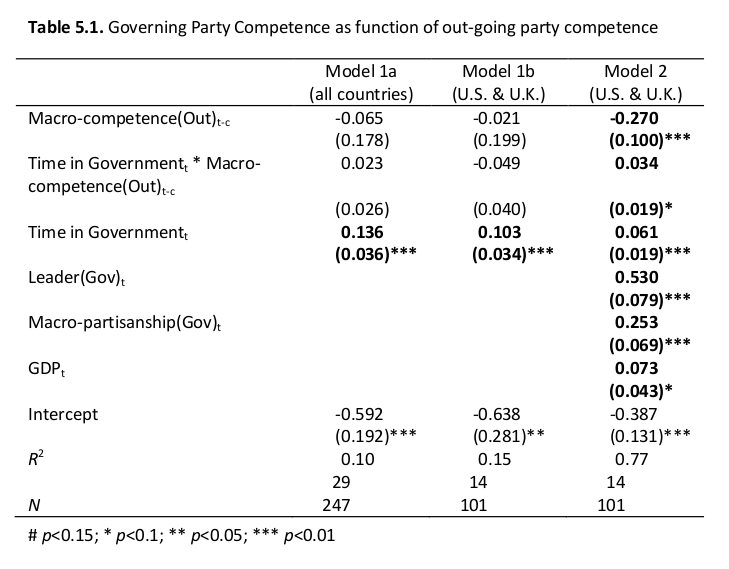

## Questions

- Is there anything governments can do?

- Can anyone spot the difference between these two men?

<div>
  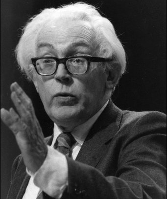
  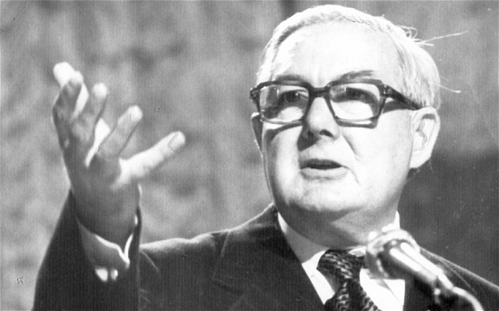
</div>

## Expectation Setting and Retrospective Voting
> "One of the most replicated and stable regularities in political science is that voters punish politicians for poor performance and reward them for good"

Is actual performance the only input for politicians? Or can they affect how their performance is evaluated by voters by setting expectations?

## Optimism 
Setting expectations shows a politician's judgement, as well as a their optimism.

<div>
  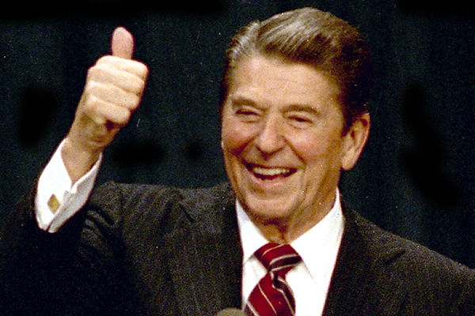
  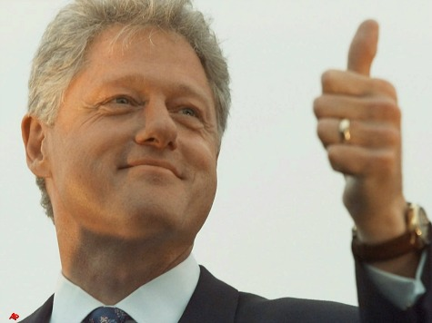
</div>

## Optimism (II)

<div>
  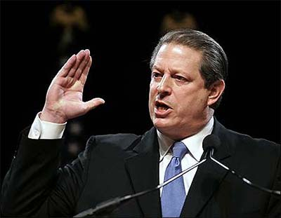 
  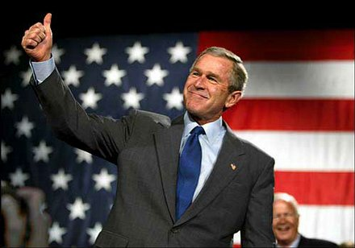
</div>

## Optimism (III)
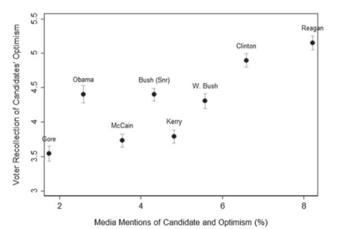

- Voters, who rated their optimism at 4.5 on a scale of 1 to 7, wanted politicians to be at 5.3, between slightly and moderately optimistic
- Though optimism ranked highly on a list of desirable personality traits, reliability and intelligence ranked more highly

## Theory

- When a politician sets an expectation, voters experience the outcome and compare it to the expectation set. Four factors are at play

    - $\alpha$ = The value of a correct prediction 
    - $\beta$ = The value of optimism as a personality trait
    - $\gamma$ = The value of a good outcome
    - *p* = The possibility of a bad outcome
    
- So that the utility of giving a high expectation is $$ U(H) = \beta + (1-p)(\alpha+\gamma) $$
- And the utility of giving a low expectation is $$ U(L) = p\alpha+(1-p)(\gamma)$$

## Theory (II) 
Whether to go high or low depends on the relative values of good judgement and optimism. The cut point $\tau$ defines below which probability it would be better to be pessimistic.
$$ U(H)-U(L)=\beta+\alpha-2p\alpha $$
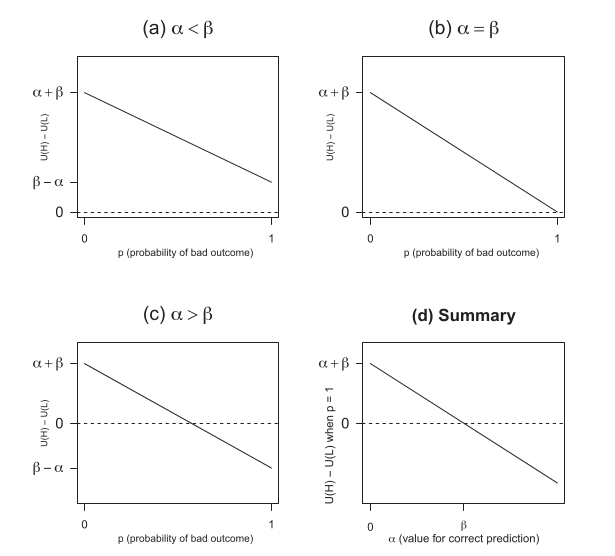


## Results
To test their theory, the authors asked respondents how their opinion would change given a random combination of positive and negative predictions and outcomes in three domains:

- Type I domains: Here politicians have **Practical Authority** as they can directly influence outcomes

- Type II domains: Here politicans have **Theoretical Authority** as they cannot directly influence the outcome, but the accuracy of their predictions says some thing relevant about their judgement

- Type III domains: Here politicians have no authority because they cannot control the outcome and the accuracy of their predictions has no bearing on their ability to govern

## Predictions
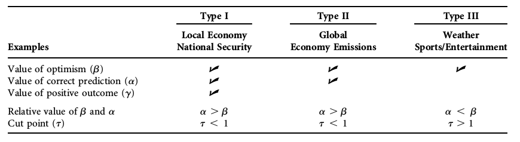

## Results
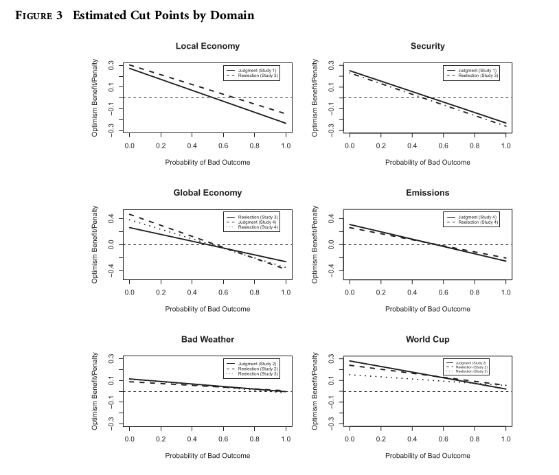

## Results (II)
### Pessimism of the intellect, optimism of the will
- The authors found that where the issue was relevant, the decision to be optimistic or pessimistic depended on the probability of something going wrong. If something is likely to go wrong, it's better to be pessimistic, but if it is likely to go right, it is better to be optimistic!

- BUT, if you are predicting the weather or a football tournament, DO NOT say that "bad weather that summer would keep many tourists away from the country" or that the national team will "not advance very far in the tournament"


Results (III)


## bla
text

```{r}
a <- 4
b <- 3
c <- 4
d <- 4

p <- c(0:10)/10

u_h <- p*b+(1-p)*(a+b+c)
u_l <- p*a+(1-p)*(c)
u_l_1 <- p*a+(1-p)*(c+d)

plot(p,u_h)
plot(p,u_l)
plot(p,u_l_1)

```

